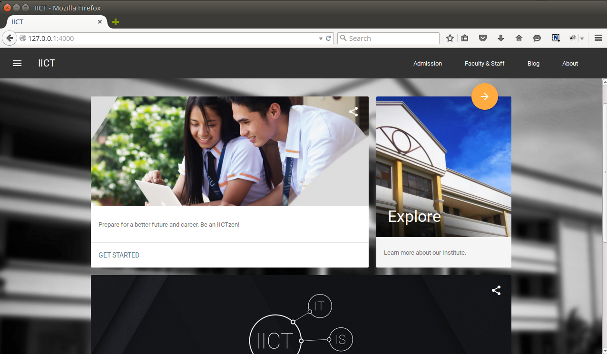

# IICT Website
> This is the website of the Institute of Information and Communications Technology of West Visayas State University - Main Campus, Luna Street, Lapaz, Iloilo City, 5000, Philippines.

This site is powered by Jekyll that implements Google's [Material Design Lite (MDL) ](https://github.com/google/material-design-lite) Components.

## Progress Snapshot
This is the current screen shot of the website.

## Task List
* Create pages.
* Add a favicon.
* Create MDL layout templates for posts and articles.
* Populate blog posts.
* Add Disqus comment hosting service to articles.
* Integrate Social buttons for facebook, twitter and google plus.
* Add a wiki to this repository.

## Local Development
> This website is built to run on GitHub. If your prefer to test a local version on your computer, please follow the instructions below:

* Clone this repository or download its contents in a [zip](https://github.com/wvsu-iict-code/iict-website.git) file.
* Install Jekyll. See the [installation instructions](http://jekyllrb.com/docs/installation/) for more details.
* Run `jekyll serve` on your current working directory using a console application.
* Browse to http://127.0.0.1:4000

## Want to contribute?
Students very are welcome to contribute to the development of this website. This will be an educational journey in which you will learn how to code socially, study new web development tools and generate content for automated static blogs.
